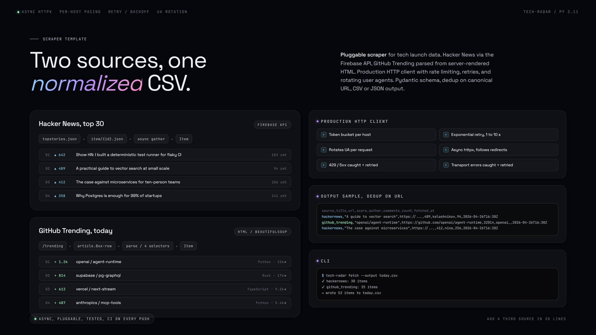

# tech-radar



Daily tech launch aggregator. Scrapes Hacker News and GitHub Trending into a single deduplicated CSV or JSON feed. Production patterns: per-host rate limiting, retry with exponential backoff, user-agent rotation, structured output, source-pluggable architecture, GitHub Actions CI.

## Why this exists

Most freelance scraping briefs ask for the same three things, framed differently every time:

1. Pull data from a list of public sources
2. Normalize it across sources into one schema
3. Drop a CSV (or JSON) on disk that the client can hand to a downstream tool

`tech-radar` is the smallest honest version of that pattern. The two sources are picked because each exercises a different scraping technique:

- **Hacker News** has a public Firebase API. The right answer is to use it, not pretend to scrape HTML for points.
- **GitHub Trending** has no API for the trending list. Server-rendered HTML, parsed with BeautifulSoup. One real selector layer, no JavaScript.

Adding a third source means dropping a file in `src/tech_radar/sources/` that exports `async def fetch(client) -> list[Item]`.

## Install

```bash
pip install -e '.[dev]'
```

## Use

```bash
# Print top items as a table, no file written
tech-radar preview

# Write a deduplicated CSV
tech-radar fetch --output today.csv

# JSON instead, only one source, only Python repos for GitHub Trending
tech-radar fetch \
  --output today.json \
  --source hackernews \
  --source github_trending \
  --gh-lang python
```

## Architecture

```
                 ┌────────────────────────────────┐
                 │  CLI (typer)                    │
                 │  tech-radar fetch / preview     │
                 └─────────────────┬───────────────┘
                                   │
                                   ▼
                 ┌────────────────────────────────┐
                 │  PoliteClient (httpx + tenacity)│
                 │  - per-host token bucket        │
                 │  - rotating UA per request      │
                 │  - retry on 429/5xx + transport │
                 └────┬────────────────────┬───────┘
                      │                    │
            ┌─────────▼─────────┐ ┌────────▼─────────────┐
            │ sources/          │ │ sources/             │
            │ hackernews.py     │ │ github_trending.py    │
            │ (Firebase API)    │ │ (HTML, BeautifulSoup) │
            └─────────┬─────────┘ └────────┬─────────────┘
                      │                     │
                      └────────┬────────────┘
                               ▼
                 ┌────────────────────────────────┐
                 │  models.Item (pydantic)         │
                 │  source / title / url / score / │
                 │  author / comments / extra      │
                 └─────────────────┬───────────────┘
                                   │
                                   ▼
                 ┌────────────────────────────────┐
                 │  CLI dedup (canonical URL)      │
                 │  output.write_csv / write_json  │
                 └────────────────────────────────┘
```

## What it demonstrates as a skill

- **Pluggable sources**: each adapter is one file with one async function. Add a fourth source in 30 lines.
- **Polite by default**: a per-host token bucket keeps the script from looking like a bot, and the retry stack survives transient 429s and network blips.
- **Pydantic output**: the schema is the contract. Downstream consumers (CSV writer, dedup, future Postgres dump) only see validated `Item` objects.
- **Dedup on canonical URL**: the same story can show up in HN and GitHub Trending. Lowercase the URL, strip the trailing slash, collapse.
- **Tested layout**: the GitHub Trending parser has a frozen HTML fixture. When GitHub redesigns the page, exactly one test fails and exactly four selectors need updating.
- **CI**: lint and tests run on every push and pull request via GitHub Actions.

## Files

- [src/tech_radar/cli.py](./src/tech_radar/cli.py): typer CLI, dedup, output orchestration
- [src/tech_radar/client.py](./src/tech_radar/client.py): polite HTTP client with retry stack
- [src/tech_radar/models.py](./src/tech_radar/models.py): `Item` pydantic schema
- [src/tech_radar/output.py](./src/tech_radar/output.py): CSV and JSON writers
- [src/tech_radar/sources/hackernews.py](./src/tech_radar/sources/hackernews.py): Firebase API adapter
- [src/tech_radar/sources/github_trending.py](./src/tech_radar/sources/github_trending.py): HTML parser
- [tests/](./tests/): schema tests and a frozen-HTML parser test

## Roadmap and known limitations

- No JS-rendered targets yet. Adding ProductHunt or LinkedIn would mean a second client behind the same `fetch` interface backed by Playwright.
- No proxy rotation. For targets that block by IP, the right path is a paid proxy pool keyed off the same `PoliteClient`.
- No persistence. Output is a flat CSV/JSON. A Postgres or SQLite writer in `output.py` is one short addition.
- No diffing. Today's run does not see yesterday's results. A `--state-file` flag that persists URLs already reported would unlock a daily diff feed.

## License

MIT.
